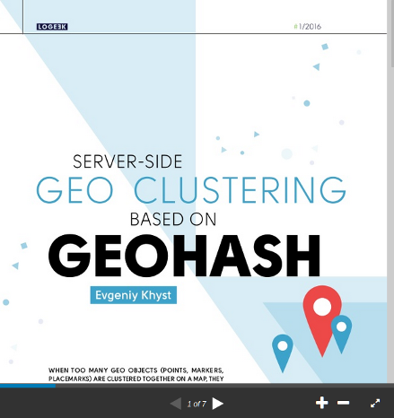

# Rents Map - Geohash Example

The example demonstrates server-side geo clustering using relational database (SQL) and [geohash](https://en.wikipedia.org/wiki/Geohash) index.

The example visualizes on a map apartment rental offers grouping offers located near one another together and representing them using colored circle of variable size.
The larger the size, the more offers are available in the area.
Color represents a price. Green - low price, yellow - average price, red - high price.
When you hover over the circle, detailed information on the number of offers and the price is displayed.

As you zoom in, the clusters are divided into smaller ones. At the maximum zoom level, circles represent individual offers.


## How is it implemented?

Read about the implementation in the [article](https://www.slideshare.net/EvgeniyKhist/serverside-geoclustering-based-on-geohash-full-article) on SlideShare.

[](https://www.slideshare.net/EvgeniyKhist/serverside-geoclustering-based-on-geohash-full-article)

## Building

### Before You Start

To build you will need [Git](http://help.github.com/set-up-git-redirect) and [JDK 11](https://www.oracle.com/technetwork/java/javase/downloads/index.html) or later.

### Get the Source Code

```bash
git clone git@github.com:evgeniy-khist/geohash-example.git
cd geohash-example
```

### Build from the Command Line

This project uses a [Gradle](http://gradle.org/) build.
The instructions below use [Gradle Wrapper](https://docs.gradle.org/current/userguide/gradle_wrapper.html) from the root of the source tree.
The wrapper script serves as a cross-platform, self-contained bootstrap mechanism for the build system.

To compile, test and build JAR use:

```bash
./gradlew clean build -i
```

## Running Locally

To run the project locally use:

```bash
./gradlew clean bootRun
```

Open URL [http://localhost:8080/geohash-example/](http://localhost:8080/geohash-example/) in a browser.

## Contributing

This project follows [Google Java Style Guide](https://google.github.io/styleguide/javaguide.html).

You may also be interested to import [intellij-java-google-style.xml](https://github.com/google/styleguide/blob/gh-pages/intellij-java-google-style.xml) IntelliJ IDEA code style XML.

## License

The Geohash Example is released under version 2.0 of the [Apache License](http://www.apache.org/licenses/LICENSE-2.0).
